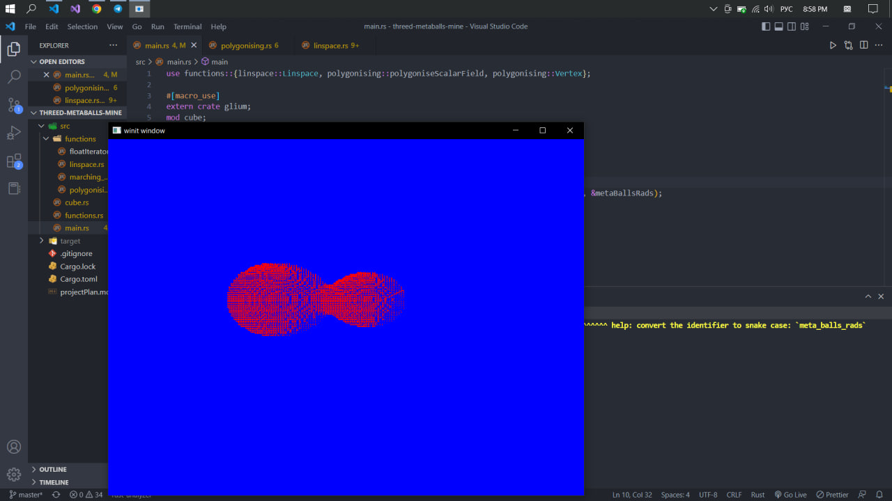

## Записки

- Сейчас я создал linspace в котором есть доступ к кубам(8 вершин с данными координатами) и к точкам ( вроде они мне больше не понадобятся)
- Я скопировал код для FloatIterator https://stackoverflow.com/questions/47867519/how-to-do-a-for-loop-with-boundary-values-and-step-as-floating-point-values
- Ура! Заработало! Я пока создал один раз запустил алгоритм и получил вершины, выглядит завораживающе! Почему-то треугольники не замыкают шар в непрерывную фигуру, где-то я напутал с индексами. 
- Я выяснил почему в треугольниках полости, кубы создаются неправильно! Между "соседними кубами" расстояние в целый step*sqrt(2)
### Будущий план :
---
* [x] (linspace.rs) рассмотреть триангуляцию для конкретной cube позиции (какие значения функции какой вершины больше заданного порога а какие нет)
* [x] (linspace.rs) рассмотреть по этой триангуляции какие ребра нужно соединить
* [x] (linspace.rs) рассмотреть две вершины которые формируют данное ребро
* [x] (linspace.rs) найти координаты середины этого ребра, которые как раз и будут координатами вершины треугольника которой должен быть отрисован
* [x] (linspace.rs) добавить эту вершину
  
  ----

* [ ] Теперь процесс триангуляции создан (но не проверен), нужно запустить вычисления, связав OpenGL и вычисления из Linspace используя Compute shader:
* [ ] См совет Николая Вадимовича __#🦄__ ниже и реализуй 


-----
Как это реализовать на глиуме?

 1. Можно в общем то запустить для main'а цикл и перед итерацией запуска pipelin'а openglя пересоздавать вершины основываясь на marching_cubes но пока это выглядит как лютый кастыль.
 2. Про верхний пункт: есть в OpenGL так называемый Compute Shader 
   
    "A Compute Shader is a Shader Stage that is used entirely for computing arbitrary information. While it can do rendering, it is generally used for tasks not directly related to drawing triangles and pixels." 

    Совет, который я получил от Николая Вадимовича: 
    ```
    Nikolai Poliarnyi [#🦄], 
    Но как минимум самый дубовый вариант - запускать compute shader чтобы создать вершины и треугольники в видеопамяти (просто массив координат и массив индексов)
    А дальше на них запустить обычный пайплайн, это наверное проще выйдет
    Плюс отлаживать проще, всегда можно будет посмотреть на промежуточный результат (отгрузив эти массивы и посмотрев на их данные)
    ```
