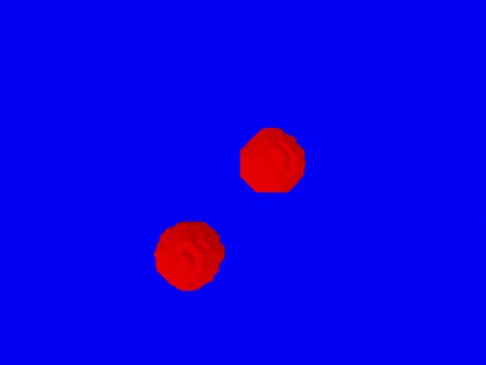

# Текущие результаты:



## Я сделал трехмерное линейное пространство, реализовал марширующие кубы и процесс триангуляции для поверхности метаболов. Затем я добавил перспективу и оценил нормали через fragment shader dfdx dfdy.


### Ниже - различные записки по ходу разработки


# Notes
- Почему нам нужен шум Перлина? Совсем случайный шум не даст непрерывную связную фигуру, если дать всем вершинам куба совсем случайные числа и менять их случайно, то их значения будут меняться скачками/дискретно. Идея же шума Перлина - интерполировать случайные значения (к примеру в простом случае - на прямой) в момент времени t-1 и t, чтобы случайные значения плавно переходили в новые - в случае с прямой мы получим непрерывную волну. 
- Perlin Noise:

The noise function requires a little more changes. But first, let's recap what we did to calculate noise at point p in the 1D case:

* We determined the integers p0 and p1 surrounding the point p
* For both p0 and p1, we calculated the product between the gradient at that point, and the difference between p and that point.
* Finally, we did an interpolation between the values calculated in the previous step
  
When you extend this to two dimensions, you get:
* Determine the four integer points on the plane p0, p1, p2 and p3 surrounding the point p ("lattice points")
* For each of those four lattice points, calculate the dot product between the gradient at the lattice point and the direction from the lattice point to the point p
* Do something similar to bilinear interpolation: interpolate between the dot products corresponding to the top two lattice points, then interpolate between the dot products corresponding to the two bottom lattice points. Finally, interpolate between the results of the previous two interpolations.

- So, overall, the idea is pretty much the same as in the 1D case, it's just that scalar values have become 2D vectors!


- Я хочу отрисовывать случайную но приятно выглядящую связную поверхность. 
Как это сделать? Можно использовать perlin noise чтобы создавать эту поверхность и изменять ее с течением времени. 
Но как связать marching cubes и сам шум? Как на шуме запустить алгоритм марширующих кубов? 
Раньше я для каждой точки (с целочисленными координатами) считал значение функции metaball и проверял выше ли она определенного порога. Теперь у меня все еще есть только доступ к целочисленным точкам моего линейного пространства а если такие точки отправлять в функцию шума то шум будет не очень красивым. 
Можно умножать координаты на какую то 0 < x < 1 и получать float значения для шума Перлина.
- Реализовал шум, но он слишком резкий. Можно заблюрить - умножить все значения индикаторного поля с учетом окружающих его точек
### Будущий план :
---
* [ ] Написать свой шум Перлина. 
* [x] (linspace.rs) рассмотреть триангуляцию для конкретной cube позиции (какие значения функции какой вершины больше заданного порога а какие нет)
* [x] (linspace.rs) рассмотреть по этой триангуляции какие ребра нужно соединить
* [x] (linspace.rs) рассмотреть две вершины которые формируют данное ребро
* [x] (linspace.rs) найти координаты середины этого ребра, которые как раз и будут координатами вершины треугольника которой должен быть отрисован
* [x] (linspace.rs) добавить эту вершину
* [x] Проверить простые случаи, типо сферы (исправил триангуляцию, создавал двоичную строку не через побитовое или, поэтому и не работало)
* [x] Добавить перспективу 
* [x] Добавить движения (пересчитывать вершины на каждом цикле)
  
  ----


-----
Как это реализовать на глиуме?

 1. Можно в общем то запустить для main'а цикл и перед итерацией запуска pipelin'а openglя пересоздавать вершины основываясь на marching_cubes но пока это выглядит как лютый кастыль.
 2. Про верхний пункт: есть в OpenGL так называемый Compute Shader 
   
    "A Compute Shader is a Shader Stage that is used entirely for computing arbitrary information. While it can do rendering, it is generally used for tasks not directly related to drawing triangles and pixels." 

    Совет, который я получил от Николая Вадимовича: 
    ```
    Nikolai Poliarnyi [#🦄], 
    Но как минимум самый дубовый вариант - запускать compute shader чтобы создать вершины и треугольники в видеопамяти (просто массив координат и массив индексов)
    А дальше на них запустить обычный пайплайн, это наверное проще выйдет
    Плюс отлаживать проще, всегда можно будет посмотреть на промежуточный результат (отгрузив эти массивы и посмотрев на их данные)
    ```
